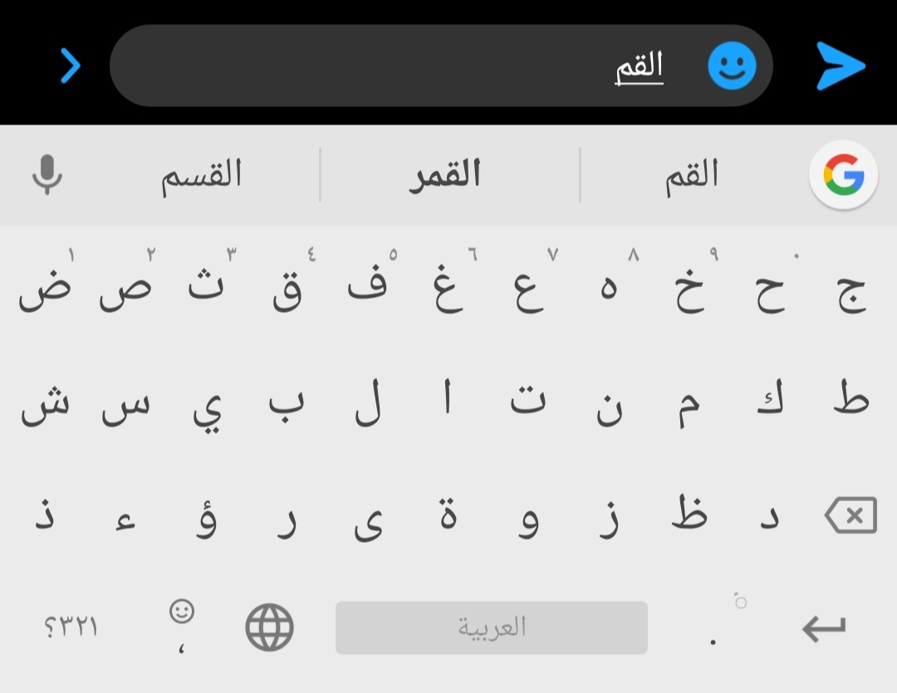

# arabic-autocorrect
الملء التلقائي للغة العربية باستخدام الاحتمالات و البرمجة الديناميكية

Arabic autocorrect using probabilistic methods and edit distance



# Dataset
Make sure to download the dataset and put it in right directory

https://github.com/elnagara/BRAD-Arabic-Dataset/tree/master/data

# Note
I Created this for practice during NLP Specialization

https://www.coursera.org/specializations/natural-language-processing

# How to use

```python
# Load pre-computed probabilities
with open('./data/probs.json', encoding='utf-8') as infile:
    data_loaded = json.load(infile) 
    vocab_loaded = data_loaded.keys() 

# Get The most probable words

# word you want to correct
source = "القهو"

# get all corrections
targets = get_corrections(source, probs, vocab, 3, verbose=False)

# Calculate edit distance
for t in targets:
    _, min_edits = min_edit_distance(source, t,1,1,1) 
    print(f'source : {source} \ntarget : {t[0]}\nprobability : {t[1]}\n')
```
